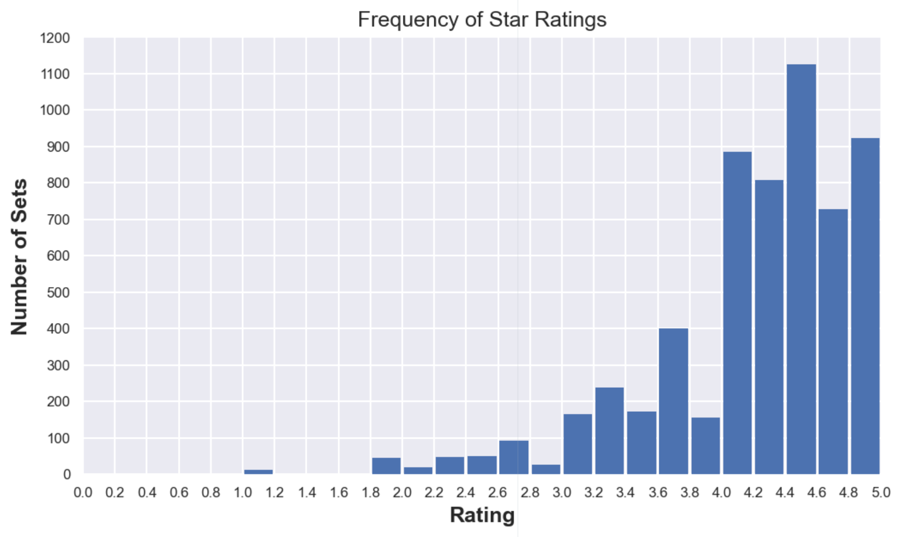
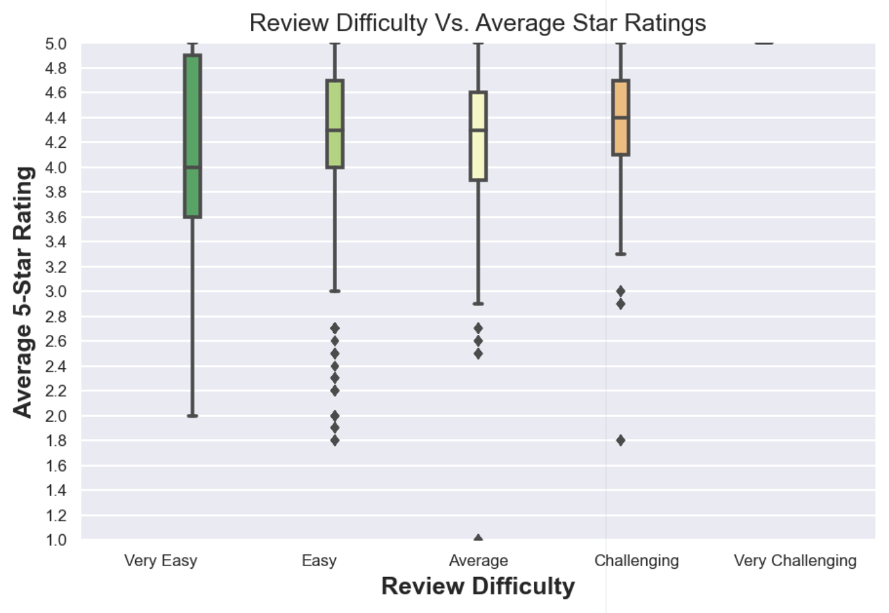
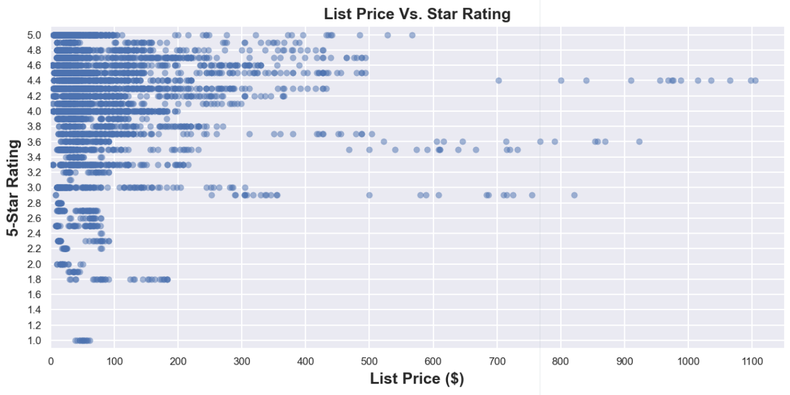
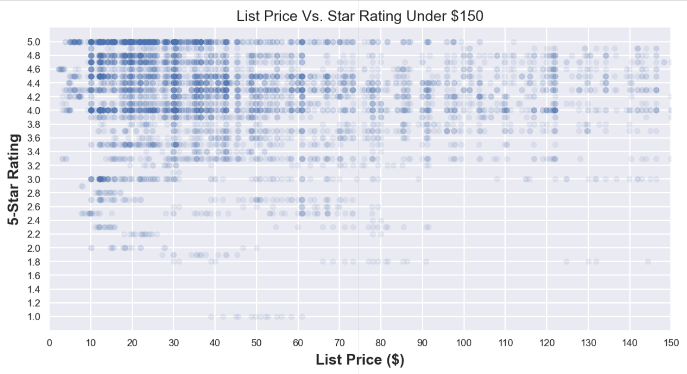
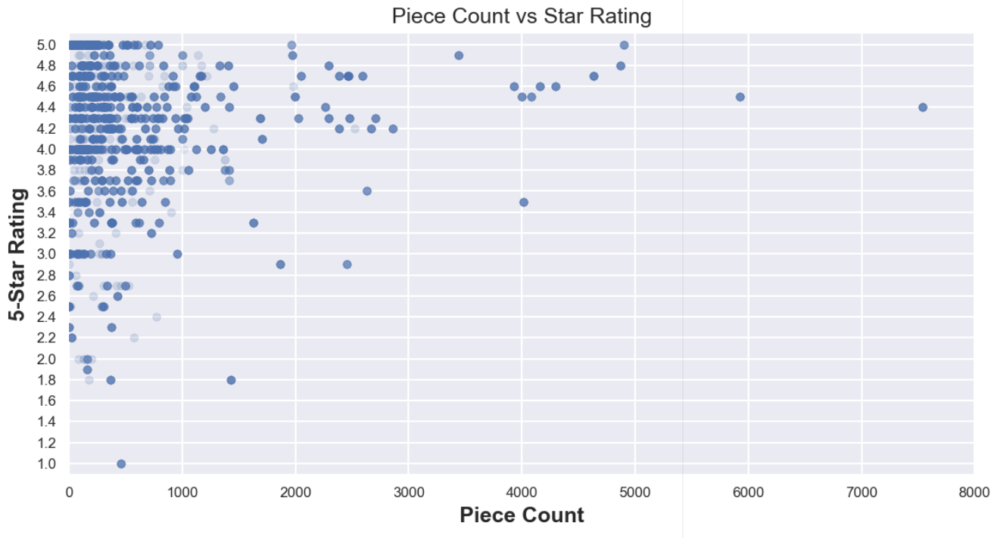
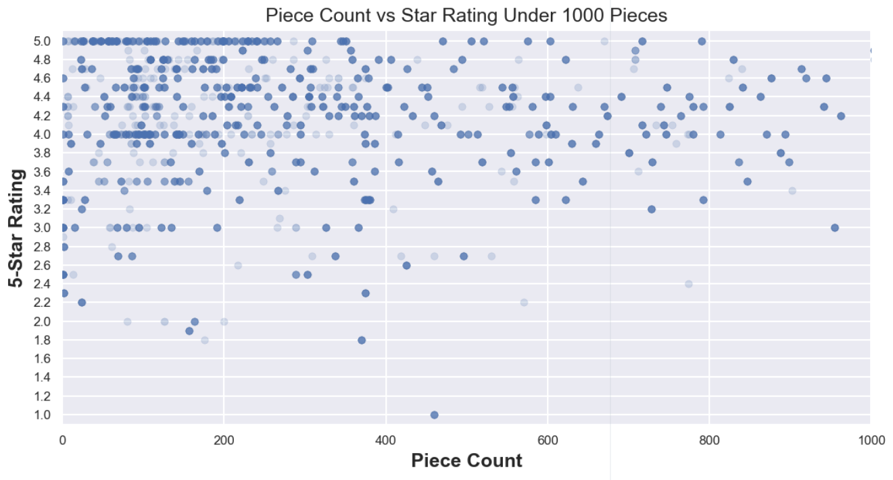
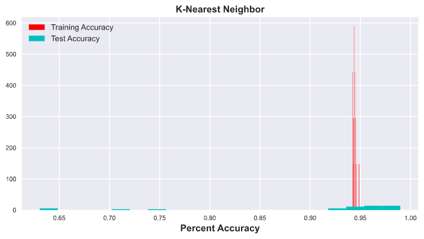

# The Lego Rating Predictor #

## Video Summary

### Update to video
This video referrences the use of a Gaussian Naive Bays classifier. Since this video's release, we have replaced this with the K-Nearest Neighbors classifier increasing our testing accuracy to an astounding 97%! The updated video that reflects these new results will be released soon. 

## Introduction ##
When most people think of Denmark, one of the first things to pop into their minds is LEGO. LEGO, a Danish company founded in 1932, is now the largest toy company in the world with an annual revenue of $2.1 billion USD. As two students who were studying in Denmark, we thought it would be appropriate to base our data analysis project on one of the cornerstones of the Country we had the honor to stay in.

We decided to explore what makes LEGO so popular. Specifically, we were curious what aspects of a LEGO set yield the best ratings on a 5.0 scale. We found two datasets on Kaggle.com that had valuable information about the LEGO inventory. The first, found [here](https://www.kaggle.com/rtatman/lego-database), was filled with useful information, from different colored bricks to the different set and theme names. All the CSVs linked together via different ids, as you can see below.

The second dataset, found [here](https://www.kaggle.com/mterzolo/lego-sets), had other numerical information like the list price, piece count and 5.0-star rating of each product. The CSV also had columns for set name and theme name, allowing us to link the two datasets together as a Pandas dataframe. We then used Pandas, MatPlotLib, and SKLearn to create graphs and a K-Nearest Neighbors classifier from our data.

## Graphs

#### Graph 1: Frequency of the Star Ratings

To start off we wanted to observe how many of each star rating we had. To prevent clutter, we decide to show it in intervals of 0.2 in a bar graph. Notable observations are that a vast majority of reviews are above a 4.0 meaning that reviewers are generally very generous with their ratings.

#### Graph 2: Review Difficulty vs. Average Star Ratings

For this graph we decided to see how the review difficulty of a LEGO set influences its overall star rating. To properly illustrate this, we decided to create a box and whisker plot because it not only shows the median and quartiles, but it also shows if there are any outliers.

Some notable observations are that while the Easy, Average, and Challenging columns are nearly identical, the Very Easy column seems to have a significantly lower 25th percentile and mean. Therefore we can conclude that the Very Easy difficulty generally has lower ratings.

A quirk of the Box and Whisker plot is observable in the Very Challenging column. The Very Challenging column only has 5 star ratings and is therefore just a line.

#### Graph 3: List Price Vs. Star Rating

Graph 3 compares the price of each LEGO set to it's price on the LEGO marketplace. While hard to interpret in the lower price region, there's a clear correlation that expensive sets ($600+) receive overall lower star ratings. This is most likely because when people spend more money they have higher expectations.

To better view the cluster of points in the under $150 range we made a second scatter plot that only lists sets under $150.

Even though it is more spread out and easier to read, there is no clear correlation (only -0.05) between list price and the star ratings for sets under $150. We believe this is because people's subconscious expectations treat these price points the same.

#### Graph 4:

Graph 4 is a comparison between the number of pieces in a set with it's star rating. Since a vast majority of sets are under 1000 pieces the graph appears cluttered and its hard to discern if there's any useful information lurking in it. Therefore we decided to stretch the x axis by limited the piece count to 1000.

With this closer look we can now tell that there are far more 5 star ratings in sets with pieces under 200 pieces. Whether this is due to there being more sets under 200 pieces overall or if the average rating decreases is not clearly observable unfortunately.  Overall, it appears that the relationship between star ratings and the piece count is marginal at best with only a 0.07 correlation coefficient.

## Machine Learning
As stated in the introduction, we attempted to use a K-Nearest Neighbors classifier to predict the optimal features for a perfect LEGO set. Specifically, we looked at the recommended age, list price, difficulty, number of reviews, and theme of each set.

Illustrated in the graph above, our program is able to predict the star ratings of LEGO sets to the nearest tenth of a star with a testing accuracy was 97.3%. Compared to a baseline accuracy of 14.1% (if someone were to guess randomly), we were blown away by these results! While the K-Nearest Neighbor classifier is by no means the most efficient, with the size of our dataset processing time was near instantaneous.  <!-- At first, we thought we must have coded our model wrong, but after triple checking our code we were certain it was correct. We then tried training our model on many of the different features we had, removing and replacing the initial four listed above, but nothing helped. Upon further inspection, we realized that trying to predict an exact rating was extremely difficult, to the point the baseline accuracy was only 14.12%! -->

## Conclusion

Although we weren't able to create the perfect machine learning model for LEGO star ratings, we label this project as an absolute success. Not only did we learn about the Gaussian Naive Bays classifier, but we also learned about the other classifier options when choosing which to use. We also learned about how to split our data and we got lots of practice graphing with MatPlotLib.

Another lesson we learned is how to tell if a dataset is a good fit for a machine learning model. In order to create a predictor, we now know that there has to be a far clearer correlation between the independent variables and the variable we're trying to predict. Thanks to this project, we will not make this mistake again. Overall this was a great learning experience and a fun way to end the Computational Analysis of Big Data class.
