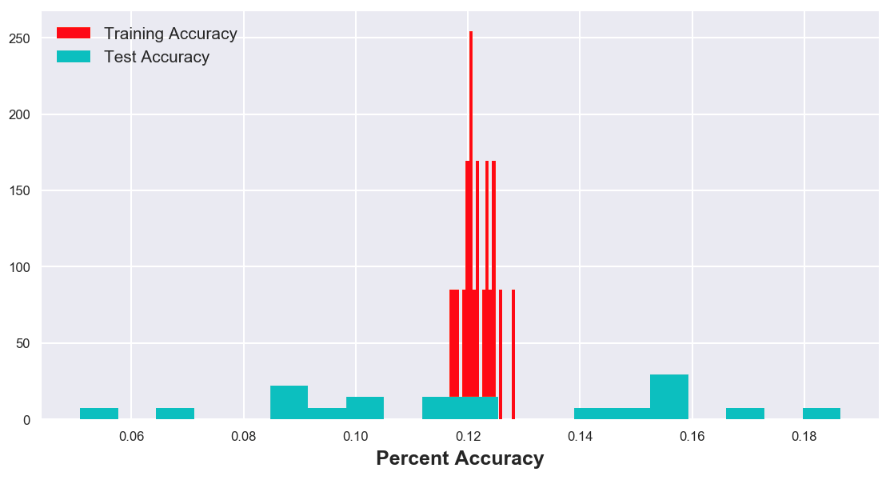

# The Lego Rating Predictor #

## Introduction ##
When most people think of Denmark, one of the first things to pop into their minds is LEGO. LEGO, a Danish company founded in 1932, is now the largest toy company in the world with an annual revenue of $2.1 billion USD. As two students who were studying in Denmark, we thought it would be appropriate to base our data analysis project on one of the cornerstones of the Country we had the honor to stay in.

We decided to explore what makes LEGO so popular. Specifically, we were curious what aspects of a LEGO set yield the best ratings on a 5.0 scale. We found two datasets on Kaggle.com that had valuable information about the LEGO inventory. The first, found [here](https://www.kaggle.com/rtatman/lego-database), was filled with useful information, from different colored bricks to the different set and theme names. All the CSVs that linked together to via different ids, as you can see below.

The second dataset, found [here](https://www.kaggle.com/mterzolo/lego-sets), had other numerical information like the list price, piece count and 5.0-star rating of each product. The CSV also had columns for set name and theme name, allowing us to link the two datasets together as a Pandas dataframe. We then used Pandas, MatPlotLib, and SKLearn to create graphs and a Gaussian Naive Bays classifier from our data.

## Graphs

#### Graph 1: Frequency of the Star Ratings

#### Graph 2: Review Difficulty vs. Average Star Ratings

For this graph we decided to see how the review difficulty of a LEGO set influences its overall star rating. To properly illustrate this, we decided to create a box and whisker plot because it not only shows the median and quartiles, but it also shows if there are any outliers.

#### Graph 3: List Price Vs. Star Rating

#### Graph 4:

## Machine Learning
As stated in the introduction, we attempted to use a Gaussian Naive Bays classifier to predict the optimal features for a perfect LEGO set. Specifically, we looked at the recommended age, list price, difficulty, and theme of each set. The one thing we were not expecting, however, was to find that the data did not lend itself to classification at all.

As you can see in the graph above, our training accuracy was only about 14%. At first, we thought we must have coded our model wrong, but after triple checking our code we were certain it was correct. We then tried testing on many of the different features we had, removing and replacing the initial four listed above, but nothing helped. Upon further inspection, we realized that trying to predict exactly a 4.3 or a 2.7 rating was extremely difficult. The data had a baseline accuracy of only 14.12%!

## Conclusion
